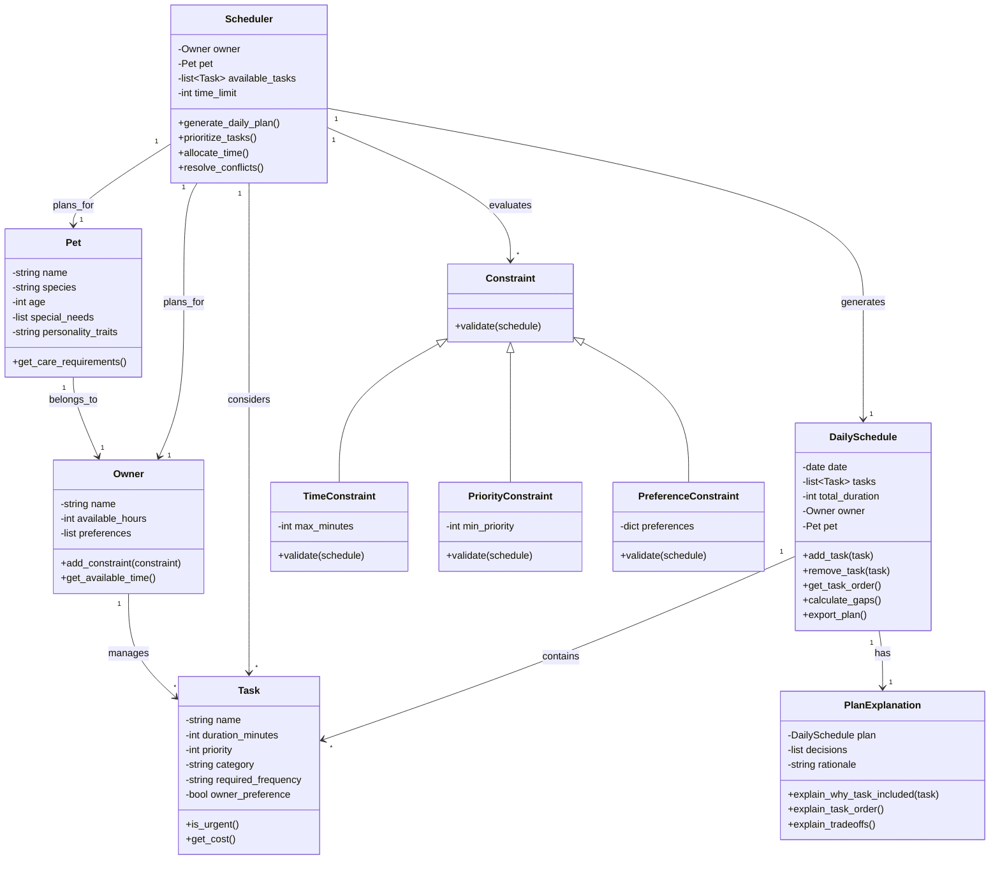

# PawPal+ Class Diagram

```mermaid
classDiagram
    class Owner {
        -string name
        -int available_hours
        -list preferences
        +add_constraint(constraint)
        +get_available_time()
    }

    class Pet {
        -string name
        -string species
        -int age
        -list special_needs
        -string personality_traits
        +get_care_requirements()
    }

    class Task {
        -string name
        -int duration_minutes
        -int priority
        -string category
        -string required_frequency
        -bool owner_preference
        +is_urgent()
        +get_cost()
    }

    class DailySchedule {
        -date date
        -list~Task~ tasks
        -int total_duration
        -Owner owner
        -Pet pet
        +add_task(task)
        +remove_task(task)
        +get_task_order()
        +calculate_gaps()
        +export_plan()
    }

    class Scheduler {
        -Owner owner
        -Pet pet
        -list~Task~ available_tasks
        -int time_limit
        +generate_daily_plan()
        +prioritize_tasks()
        +allocate_time()
        +resolve_conflicts()
    }

    class PlanExplanation {
        -DailySchedule plan
        -list decisions
        -string rationale
        +explain_why_task_included(task)
        +explain_task_order()
        +explain_tradeoffs()
    }

    class Constraint {
        +validate(schedule)
    }

    class TimeConstraint {
        -int max_minutes
        +validate(schedule)
    }

    class PriorityConstraint {
        -int min_priority
        +validate(schedule)
    }

    class PreferenceConstraint {
        -dict preferences
        +validate(schedule)
    }

    %% Relationships
    Owner "1" --> "*" Task : manages
    Pet "1" --> "1" Owner : belongs_to
    Scheduler "1" --> "1" Owner : plans_for
    Scheduler "1" --> "1" Pet : plans_for
    Scheduler "1" --> "*" Task : considers
    Scheduler "1" --> "1" DailySchedule : generates
    DailySchedule "1" --> "*" Task : contains
    DailySchedule "1" --> "1" PlanExplanation : has
    Constraint <|-- TimeConstraint
    Constraint <|-- PriorityConstraint
    Constraint <|-- PreferenceConstraint
    Scheduler "1" --> "*" Constraint : evaluates
```
