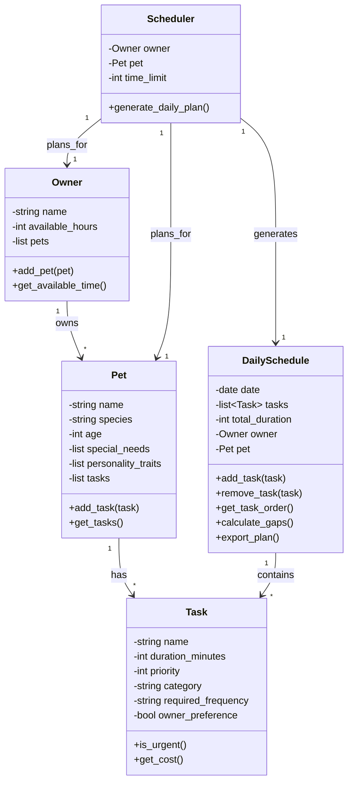

# PawPal+ Class Diagram

```mermaid
classDiagram
    class Owner {
        -string name
        -int available_hours
        -list pets
        +add_pet(pet)
        +get_available_time()
    }

    class Pet {
        -string name
        -string species
        -int age
        -list special_needs
        -list personality_traits
        -list tasks
        +add_task(task)
        +get_tasks()
    }

    class Task {
        -string name
        -int duration_minutes
        -int priority
        -string category
        -string required_frequency
        -bool owner_preference
        +is_urgent()
        +get_cost()
    }

    class DailySchedule {
        -date date
        -list~Task~ tasks
        -int total_duration
        -Owner owner
        -Pet pet
        +add_task(task)
        +remove_task(task)
        +get_task_order()
        +calculate_gaps()
        +export_plan()
    }

    class Scheduler {
        -Owner owner
        -Pet pet
        -int time_limit
        +generate_daily_plan()
    }

    %% Relationships
    Owner "1" --> "*" Pet : owns
    Pet "1" --> "*" Task : has
    Scheduler "1" --> "1" Owner : plans_for
    Scheduler "1" --> "1" Pet : plans_for
    Scheduler "1" --> "1" DailySchedule : generates
    DailySchedule "1" --> "*" Task : contains
```
